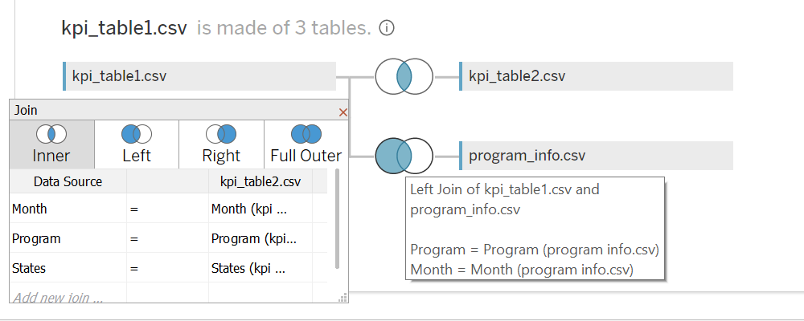
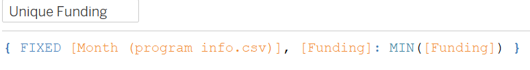

# Ministry of Agricultural Expansion

## Introduction:

This document provides a comprehensive guide to the dashboard designed for the Ministry of Agricultural Expansion. The dashboard aims to facilitate the monitoring and evaluation of the effectiveness of four key programs (Samruddhi, Vikas, Jeevan, and Sarvang) across different states in India. The synthetic dataset used in the dashboard contains monthly metrics such as the number of beneficiaries, disbursements, loans, training sessions, new businesses supported, and monthly funding received by each program.

## Data cleaning 

Before developing the dashboard, an overview of the data  was undertaken. The following steps were implemented:

- **Data Wrangling:** 
   - This is the first step where inspection of data is done to check for NULL values, any inconsistent data, or any anomalies within the data set.

- **Consistent Formatting:**
  - Data formats were standardized to ensure uniformity, facilitating seamless integration into the dashboard.
## Approach
This dataset offers four tables containing monthly number of beneficiaries, disbursements made to beneficiaries, number of loans, training sessions conducted, and new businesses supported by state and program, as well as the monthly funding received by each program.

Table 1. KPI_table1

| Column | Description |
|----------|----------|
| Program | Name of the Program | 
| State  | The name of the state |
| Month | Name of the month |
| Total Beneficiaries | In figures |
| Total Disbursement | In figures |

Table 2. States

| Column | Description | 
|----------|----------|
| State | Name of the state | 
| ISO_Code | Code of the state |

Table 3. KPI_table2

| Column | Description |
|----------|----------|
| Program | Name of the Program | 
| State  | The name of the state |
| Month | Name of the month |
| Number of Loans Issued | In figures |
| Number of Training Sessions Conducted | In figures |
|Number of New Businesses Supported | In figures |

Table 4. Program_info

| Column | Description |
|----------|----------|
| Program | Name of the Program | 
| Abv  | Program abbreviation |
| Month | Name of the month |

I identified three key tables for my use case: kpi_table1, kpi_table2, and program_info. These tables were uploaded into Tableau, where I performed necessary data integration by joining them. Firstly, I executed an inner join between kpi_table1 and kpi_table2, utilizing common fields such as program, state, and month. Subsequently, I extended this integration by employing a left join between kpi_table1 and program_info on program and state. The resultant dataset for this dashboard encompasses a total of 15 columns and 96 rows, representing a comprehensive compilation of key performance indicators and program information.

In the construction of my Tableau dashboard, I strategically utilized a calculated field with the expression { FIXED [Month (program info.csv)], [Funding]: MIN([Funding]) }. This calculated field is designed to discern the first funding amount within each distinct month, focusing specifically on the Funding variable from the program_info.csv dataset. The FIXED keyword is employed to establish the level of detail, isolating the calculation to operate at the granularity of each unique month.

 
## Time Period of the Project.
The data used in this project spans the time period of June to November 2022. 
## Target audience for the data viz/dashboard & Purpose
- The primary audience for this data visualization/dashboard is The Ministry of Agricultural Expansion stakeholders.

- The dashboard aims to facilitate the monitoring and evaluation of the effectiveness of four key programs (Samruddhi, Vikas, Jeevan, and Sarvang) across different states in India. 
## Tools Used
* Tableau Desktop, Excel.
- link to the interactive dashboard.
 https://public.tableau.com/app/profile/erick.ndegwa/viz/MinistryofAgricultureExpansionDashboard/MinistryDashboard
## Design Decisions and Context
- **User-Centric Interface:**
  - The dashboard is crafted with a user-centric approach, ensuring an intuitive and easily navigable interface. This design enables stakeholders to seamlessly explore and interpret Various Metrics.

- **Interactivity for Insightful Exploration:**
  - Leveraging the interactive features of Tableau, users can dynamically drill down into specific data points, apply filters, and extract actionable insights. 

- **Focus on Key Metrics:**
  - The visualization places a strong emphasis on key metrics states, programs, Time period, number of loans, training sessions, and new businesses supported. Users can easily discern trends and patterns.

- **Aesthetic Clarity for Information Absorption:**
  - Aesthetics play a pivotal role in the design, with careful consideration given to visual clarity and a cohesive layout. The visually appealing presentation ensures that users can absorb information effortlessly, fostering a more engaging and insightful experience.

By aligning these design considerations, the dashboard aims to provide a robust platform for diverse users to gain meaningful insights.
## Dashboard overview
The dashboard is designed to answer specific questions outlined by the Ministry, providing a holistic view of the performance of agricultural expansion programs. It includes interactive visualizations and filters to enable users to explore and analyze the data in a user-friendly manner.

## Key Features:

- **Total Metrics Overview:**
  - Displays the total number of beneficiaries, disbursements, loans, training sessions, and new businesses supported by each program.

- **State Comparison:**
  - Allows users to compare the number of beneficiaries and total disbursement between states for a selected program.

- **Disbursement vs Funding Comparison:**
  - Compares total disbursements to the monthly funding amount for a selected program.

- **Funding Distribution Over Time:**
  - Depicts the distribution of funding across programs over time for each selected program.

- **Variation by Program and State:**
  - Shows how the number of loans, training sessions, and new businesses supported vary by program and state.

- **Filtering Options:**
  - Enables users to filter data by state, month, and program to gain granular insights.

## Answering Ministry's Questions
 **Total Indicators:**
  - The total number of beneficiaries, disbursements, loans, training sessions, and new businesses supported by each program is available at a glance.

- **State and Program Comparison:**
  - Users can easily compare the number of beneficiaries and total disbursement between states for a given program using interactive Map chart.

- **Disbursements vs Funding:**
  - A comparative analysis is provided to understand how total disbursements compare to the monthly funding amount for each program using the packed bubbles chart.

- **Funding Distribution Over Time:**
  - The Bar chart illustrates changes in funding distribution across programs over time through the Month filter.

- **Variation by Program and State:**
  - Users can explore how the number of loans, training sessions, and new businesses supported vary by program and state using the  detailed table visualization.
## User Guide
 - **Filtering:**
      - Users can filter data by state, month, and program using dropdown menus to focus on specific parameters.

 - **Interactivity:**
      - Hovering over data points provides additional information, and users can zoom in on specific time periods.

## Support and Feedback
  - Users are encouraged to provide feedback or seek support for any issues encountered while using the dashboard.